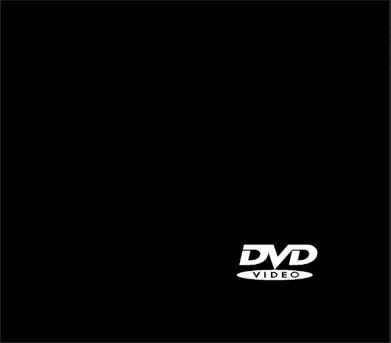

# DVD-Video Animation
Animation like the classic tv screensaver.




# Dependencies

Debian based systems:
```
$ sudo apt install libsdl2-dev
```

Arch based systems:
```
$ sudo pacman -S sdl2
```


# Installation
***NOTE***
only tested / written for linux

Clone the repository:
```
$ git clone https://github.com/Pieli/dvd_animation.git
```
Change directory and compile:
```
$ cd dvd_animation && make
```

# Run animation 
change permission:
```
$ chmod +x dvd
```
run:
```
$ ./dvd
```


